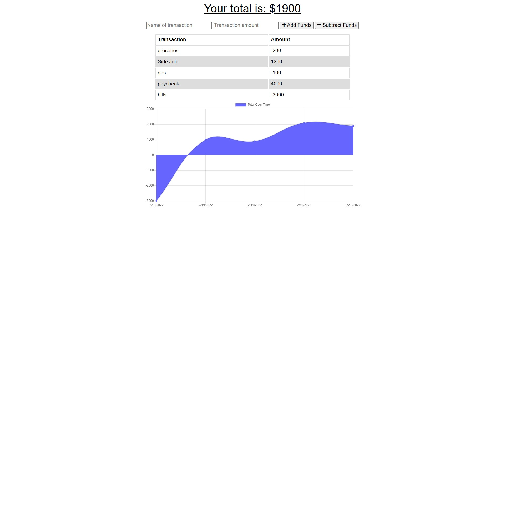

# trackYourBudget

## Description
This PWA allows users to track their monthly expenses regardless of internet connection. Users will be able to add expenses to their tracker with no internet connection due to indexedDB caching the post and saving it until the connection is restored. 

## Table of Contents (Optional)
* [Installation](#installation)
* [Usage](#usage)
* [Contributing](#contributing)
* [Questions](#questions)

## Installation
Clone the repo, install dependiencies, then run "npm start". The User must have MongoDb installed on their computer for this to work. In order to test it's offline functionality, please use Chrome`s Dev Tools to turn the connection to offline.

## Usage
This is what it will look like on your device. 

[Deployed Application](https://newbudgetappcreation.herokuapp.com/)

## Contributing
U of A contributed the Front and Backend code for this project. I added the service-worker.js, Manifest.json, and ibd.js. I also had help from my classmate Jennifer Lucas and my tutor Spencer Creer.

## Questions
Please checkout my [Github](https://github.com/Nkepers) for other projects.